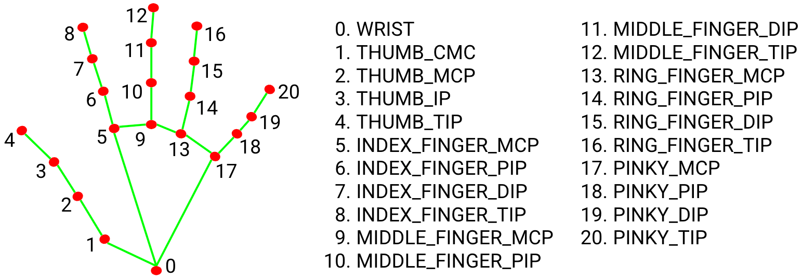

# Finger Counter using OpenCV and MediaPipe

The diagram above shows a hand landmark model that shows how MediaPipe tracks hands. This article will focus on the hand knuckles.

The diagram shows numbers from 0 to 20 displayed over the knuckles. We will be using the position of these knuckles to determine whether a finger is open or closed.

Let us take a look at the logic we will be using:

-> If knuckle number 8 is above knuckle number 6, then the finger is open. If it is below knuckle number 6, then the finger is closed.
-> This will apply to all fingers except the thumb. For the thumb, we will check whether knuckle number 4 is above knuckle number 2. If this is the case, then the thumb is open else, the thumb is closed.
